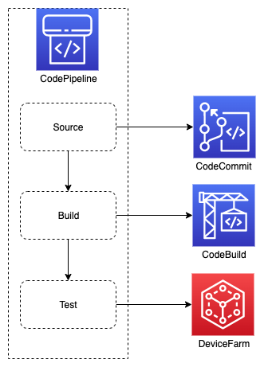

# E2E Testing with Device Farm

This solution demonstrates how to use device farm for end to end web testing on mobile devices as part of cicd pipeline, using CDK in Typescript. The solution accompanies [this blog post](https://medium.com/i-love-my-local-farmer-engineering-blog/dns-multi-account-management-using-cdk-6394ef295eee) from the [I Love My Local Farmer Engineering Blog Series](https://medium.com/i-love-my-local-farmer-engineering-blog).

This README.md contains only architecture and deployment steps. For more details, please check the blog post

# Pre-requisites

1. **AWS CLI v2:** with AWS credentials configured (See steps [here](https://docs.aws.amazon.com/cdk/latest/guide/getting_started.html#getting_started_prerequisites))
1. **AWS CDK (v. 2.2.0 or higher):** for infrastructure and code deployment (See installation steps [here](https://docs.aws.amazon.com/cdk/latest/guide/getting_started.html#getting_started_install)

# Deployment Steps

```
npm install
npm run deploy
```

# Architecture


